# Consumer-Driven Contract Testing with Pact

**Work-in-progress.**


An example of applying Consumer-Driven Contract Testing (CDC) for testing microservice compatibility in isolation.

- [Consumer-Driven Contract Testing with Pact](#consumer-driven-contract-testing-with-pact)
  - [What is Contract Testing](#what-is-contract-testing)
  - [Consumer-Driven Contract Testing](#consumer-driven-contract-testing)
  - [What Contract Testing is Not](#what-contract-testing-is-not)
  - [Pact as a Consumer-Driven Contract Testing Tool](#pact-as-a-consumer-driven-contract-testing-tool)
  - [Example Application Architecture (C4)](#example-application-architecture-c4)
    - [System Context Diagram](#system-context-diagram)
    - [Container Diagram](#container-diagram)
  - [Using Pact for Testing the Example Application](#using-pact-for-testing-the-example-application)
    - [Example Application's Pact Network Diagram](#example-applications-pact-network-diagram)
    - [Run Pact Contract Tests Locally with Self-Hosted Pact Broker](#run-pact-contract-tests-locally-with-self-hosted-pact-broker)
    - [Run Pact Contract Tests with PactFlow.io](#run-pact-contract-tests-with-pactflowio)
  - [Running Pact in a Deployment Pipeline (CI/CD)](#running-pact-in-a-deployment-pipeline-cicd)
    - [Setting up the Deployment Pipeline for the Example Application](#setting-up-the-deployment-pipeline-for-the-example-application)
      - [When the Consumer Changes](#when-the-consumer-changes)
      - [When the Provider Changes](#when-the-provider-changes)
    - [Configuring Pact Broker/PactFlow with Terraform](#configuring-pact-brokerpactflow-with-terraform)
  - [Testing Breaking Changes in Contracts with Pact](#testing-breaking-changes-in-contracts-with-pact)
    - [Contract Testing Protobufs and Similar Structured Data Serialization Formats](#contract-testing-protobufs-and-similar-structured-data-serialization-formats)
    - [Breaking Consumer Contract](#breaking-consumer-contract)
    - [Breaking Provider Contract](#breaking-provider-contract)
  - [Best Practices for Writing Consumer Contract Tests with Pact](#best-practices-for-writing-consumer-contract-tests-with-pact)
  - [Contract Testing Beyond Catching Breaking Changes](#contract-testing-beyond-catching-breaking-changes)
  - [Limitations and Corner Cases](#limitations-and-corner-cases)
  - [References](#references)
  - [Development](#development)
    - [Example Application's Sample Requests](#example-applications-sample-requests)
    - [Links](#links)
    - [Commands](#commands)

## What is Contract Testing

One of the most useful properties of microservices is the ability develop, test and deploy services independently.
It gives us the possibility to independently scale teams and reduce dependencies between them, ultimately increasing the agility of the whole organization.
To facilitate loose coupling between microservices and team autonomy, contracts are established between microservices and team boundaries.

A contract establishes a clear shared understanding of how different microservices will communicate with each other.
A contract includes both the _syntactic_ and _semantic_ expectations of the communication.
Syntax is the expected message schema and data types. Semantics is the meaning of the message,
e.g. valid combinations of provided values, and the resulting behavior.

Microservices create value only when they interact with other microservices in the system, therefore they must communicate with each other.
That's the puzzle: we want to reap the benefits of independent deployability,
but we must make sure that the services are compatible with each other, i.e. there're no breaking changes in the contracts.

The most widely used technique for testing compatibility is integrated end-to-end testing.
With this approach, before releasing a single microservice to production environment,
all microservices are deployed to a shared testing environment, and a suite of end-to-end tests is ran against them.
The promise of integrated end-to-end tests is to discover all incompatible changes between the system components,
and verify that the system works as a whole.
To summarize, to ensure that a single microservice is compatible with the whole system,
it must be deployed and tested together with all other microservices on a testing environment.
This contradicts with the goal of microservice independent deployability, because you can't deploy
a service until it's tested with all other services together at the same time.

The end-to-end testing approach is useful, but in the microservice-based system it has some
significant drawbacks _at a certain scale point_:

- Integrated end-to-end tests by their nature are slow compared to isolated microservice-level tests.
  As the system grows and more end-to-end tests are added, the test execution time will grow super-linearly.
  An alternative to running all the tests at once is to run only a subset of tests that concern a particular microservice's
  business domain, but that will increase the risk of missing a breaking change in other parts of the system.
- End-to-end tests are brittle and flaky. Since they depend on the whole system and the state of a testing environment,
  there're many factors that can cause the tests to fail, even if the system is working correctly.
  Flaky tests erode the trust in the test suite and the whole deployment pipeline.
- Since all the teams will depend on the same testing environment, there's a possibility of a queue forming for running the tests.
  While one team is working on fixing a failing end-to-end test which fails the whole deployment pipeline, other teams will have to wait.
  This will increase the deployment lead time, ultimately reducing the number of deployments,
  since teams will have to wait for their turn to test their changes. You can scale number of testing environments
  or have a dedicated testing environment for each team, but only up to a certain point due to the infrastructure and maintenance costs.
- End-to-end test ownership without introducing dependencies between teams is a challenge.
  A single end-to-end test might span across many microservices and internal team boundaries, testing bigger features as a whole.
  Therefore, an organization might have a dedicated test automation team that writes the end-to-end tests.
  However, when a test gets broken and needs changes, a development team will have a dependency on the test automation team.
  Another approach is to have a collective ownership of the tests, but that could result in an explosion of test cases
  and decrease in the test codebase coherence, as different teams won't have a clear visibility into what's already been tested.

End-to-end tests in a microservice-based system are still useful to verify the system as a whole,
however, they should be used sparingly, for example, for testing the most critical business flows.

You could also experiment with when the end-to-end tests are run.
For example, instead of running end-to-end tests in a deployment pipeline, their could be periodically run
in a production environment. To make it safe, the tests must use fake data, e.g. place orders to known fake customers
that are configured to not ship real products.
This approach is called [Synthetic Monitoring (or Semantic Monitoring)](https://martinfowler.com/bliki/SyntheticMonitoring.html).
It will serve for detecting system-wide issues, but won't be able to prevent release of incompatible changes.

The immediate drawbacks of end-to-end tests can be remedied by adjusting the scope of the tests,
experimenting with test ownership and test environment availability, but the fundamental problem of
end-to-end tests is that _they don't scale well as the system growth_.

**For testing microservice compatibility, an alternative approach to integrated end-to-end testing is to contract testing.**

> Contract testing is a technique for testing an integration point by checking each application in isolation
> to ensure the messages it sends or receives conform to a shared understanding that is documented in a "contract".
> — _<https://docs.pact.io/#what-is-contract-testing>_

- [x] Contract testing vs integrated end-to-end testing
- [ ] Contract testing vs functional testing
- [ ] Types of contract testing: consumer-driven, bi-directional, provider-driven etc.
- [ ] <https://www.youtube.com/watch?v=vq8o_AFfHhE>

... TODO

## Consumer-Driven Contract Testing

- [ ] Consumer-driven contract testing as a collaboration technique
  - Fostering clear lines of communication and collaboration, between microservices and teams that consume them
  - Consumer-driven contract tests make communication between the teams explicit.
  - The explicit reminder of [Conway’s Law](https://martinfowler.com/bliki/ConwaysLaw.html).
  - Agile stories are often referred to as a placeholder for a conversation. CDCs are just like that

... TODO

## What Contract Testing is Not

- [ ] Not functional testing
- [ ] Consumers must not exhaustively test all the Provider's functionality
- [ ] Not for testing public APIs where consumers are not known or there're too many of them

... TODO

## Pact as a Consumer-Driven Contract Testing Tool

This example project uses [Pact](https://pact.io) for consumer-driven contract testing.

> Pact is a code-first tool for testing HTTP and message integrations using contract tests.
> Contract tests assert that inter-application messages conform to a shared understanding that is documented in a contract.
> Without contract testing, the only way to ensure that applications will work correctly together is by using expensive and brittle integration tests.
> — _<https://docs.pact.io/>_

The example project is written in Python, so it uses [Pact Python](https://github.com/pact-foundation/pact-python) implementation.
Pact is available for many other languages as well, see the full list on the [Pact website](https://pact.io).

## Example Application Architecture (C4)

The example application is a made-up e-commerce system built as microservices.

### System Context Diagram

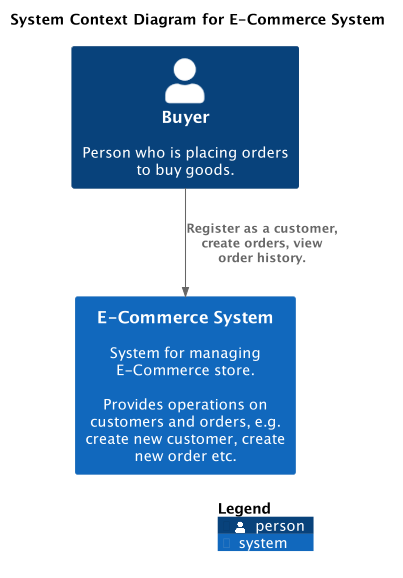

### Container Diagram

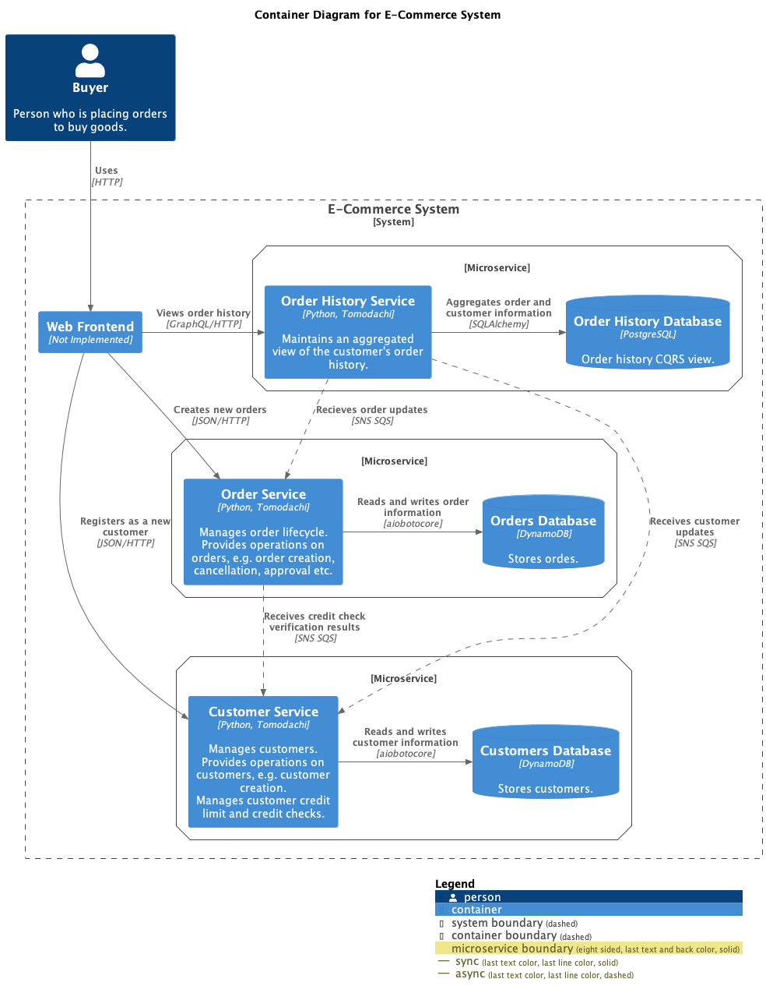

## Using Pact for Testing the Example Application

The example application demonstrates how to use Pact for contract testing microservices that
communicate over synchronous HTTP (REST and GraphQL), and asynchronous messaging (AWS SNS SQS).

In this example application, the [Pacticipant](https://docs.pact.io/pact_broker/advanced_topics/pacticipant)
names follow a convention `<application-name>--<communication-protocol>`.
For example, `service-customers--rest` is a `service-customers` application communicating over REST (synchronous HTTP),
and `service-customers--sns` is a `service-customers` application communicating over SNS (asynchronous messaging).

The need to name Pacticipants depending on the communication protocol is because Pact uses
different mechanisms for verifying contracts depending on whether it's a synchronous HTTP-based protocol or asynchronous messaging.
Pact HTTP contract tests use `pact.Verifier`, and Pact asynchronous messaging contract tests use `pact.MessageProvider`,
and they can't be mixed.

- List of the example application's Pacticipants:
  - `frontend--graphql`
  - `frontend--rest`
  - `service-customers--rest`
  - `service-customers--sns`
  - `service-order-history--graphql`
  - `service-order-history--sns`
  - `service-orders--rest`
  - `service-orders--sns`

### Example Application's Pact Network Diagram

Generated from Pact Broker's <http://localhost:9292/integrations> endpoint with
[generate_pact_network_diagram.py](src/diagram/generate_pact_network_diagram.py) script.

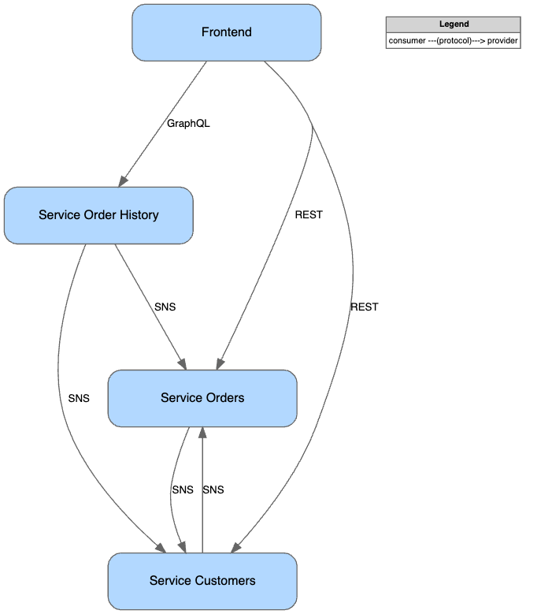

### Run Pact Contract Tests Locally with Self-Hosted Pact Broker

From [Pact Broker Introduction](https://docs.pact.io/pact_broker) page on Pact documentation website:

> The Pact Broker is an application for sharing consumer driven contracts and verification results.
> The Pact Broker is an open source tool that requires you to deploy, administer and host it yourself.

- Install Pact CLI - [complete installation instruction on GitHub Releases page](https://github.com/pact-foundation/pact-ruby-standalone/releases).

```bash
curl -fsSL https://raw.githubusercontent.com/pact-foundation/pact-ruby-standalone/master/install.sh | PACT_CLI_VERSION=v2.0.10 bash
```

- Install Python dependencies with [Poetry](https://python-poetry.org/).

```bash
poetry install --with dev
poetry shell
```

- Set PYTHONPATH to include `src` directory.

```bash
export PYTHONPATH=src:tests:$PYTHONPATH
```

- Run example application and Pact Broker locally with Docker Compose.

```bash
docker compose up
```

- Open local Pact Broker UI - <http://localhost:9292>.
  Login with `pactbroker`/`pactbroker` credentials.
  The list of contracts should be empty because we haven't run any tests yet.

- Run `consumer` tests first (remember about consumer-driven).
  Pact will generate contract files and save them in the `pacts` directory.

```bash
poetry run pytest -m "consumer"
```

- Pact Broker UI (<http://localhost:9292>) should still be empty because
  we haven't published contracts from `pacts` directory to the Pact Broker yet.

- Publish contracts from the `pacts` directory to the local Pact Broker.
  **Note: don't store your Pact Broker credentials in plain text;** this project is just an example.

```bash
pact-broker publish --auto-detect-version-properties \
    --broker-base-url http://localhost:9292 \
    --broker-username pactbroker \
    --broker-password pactbroker \
    pacts
```

- Refresh Pact Broker UI (<http://localhost:9292>) and you should see the list of contracts.
  Notice that `Last Verified` column is empty because the contracts haven't been verified
  against the `providers` yet.

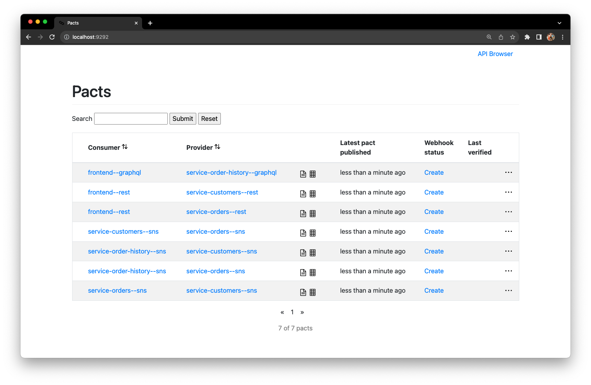
_Pact Broker - contracts are not verified_

- Verify `provider` contracts from the local Pact Broker.
  The Pact `provider` tests will fetch the latest contracts from the Pact Broker and run the tests against them.
  Verification results will be published back to the Pact Broker
  because `PACT_PUBLISH_VERIFICATION_RESULTS` environment variable is set to `true`.
  Usually, you would publish test results to the Pact Broker only in the CI/CD pipeline,
  so when working on a production project, omit the environment variable when running tests locally.

```bash
PACT_PUBLISH_VERIFICATION_RESULTS=true poetry run pytest -m "provider"
```

- Refresh Pact Broker UI (<http://localhost:9292>) and you should that all contracts have been verified.

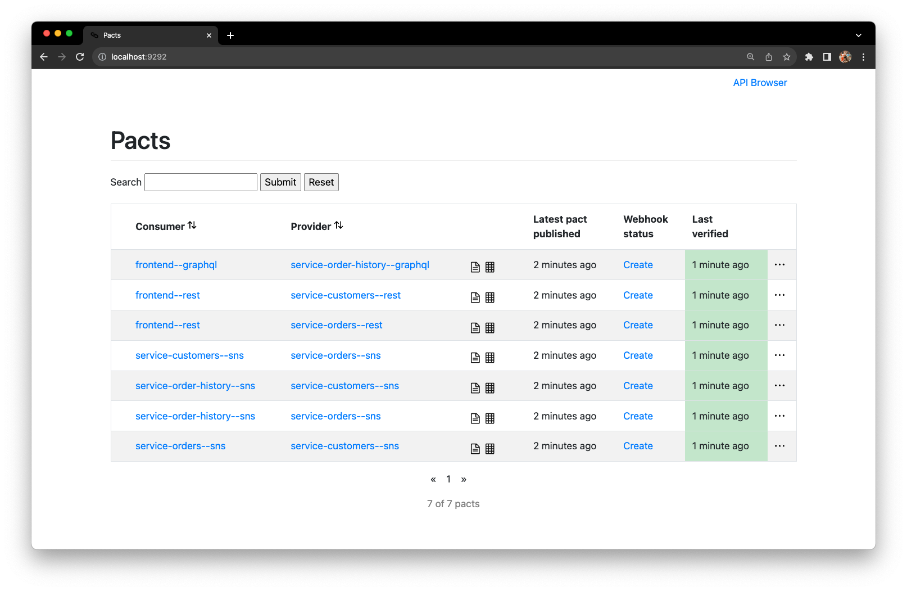
_Pact Broker - contracts are verified_

### Run Pact Contract Tests with PactFlow.io

PactFlow.io is a SaaS version of Pact Broker. It has a free tier for up to 5 integrations,
which is suitable for a proof-of-concept. Read more about PactFlow in the [PactFlow documentation](https://docs.pactflow.io/).

- Create a free account on <https://pactflow.io>

- Generate [read/write API token](https://docs.pactflow.io/#configuring-your-api-token) for your PactFlow account
  and set environment variables:

```bash
export PACT_BROKER_BASE_URL=https://<your-account-name>.pactflow.io
 export PACT_BROKER_TOKEN=<your-read-write-api-token>
```

- Remove previously generated contracts from the `pacts` directory.

```bash
rm -r pacts/*.json
```

- Run `consumer` tests. This time, include `pactflow` marker to run only a subset of tests,
  since the PactFlow free tier has a limit of 5 integrations.

```bash
poetry run pytest -m "consumer and pactflow"
```

- Publish contracts from the `pacts` directory to the PactFlow. Notice that we don't need to specify
  Pact Broker URL and credentials because they are already set in the environment variables.

```bash
pact-broker publish --auto-detect-version-properties pacts
```

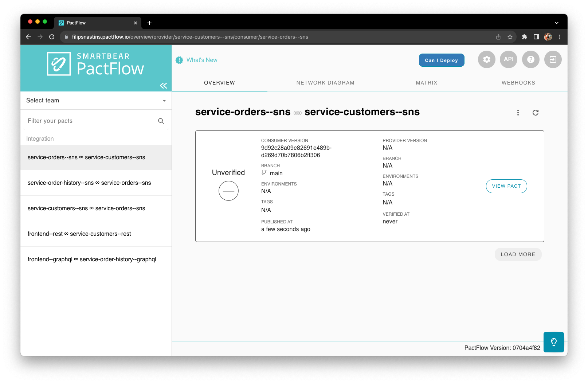
_PactFlow - contracts are not verified_

- Verify Pacts and publish verification results.
  Usually, you would publish test results to the Pact Broker only in CI/CD pipeline,
  so when working on a production project, omit the environment variable when running tests locally.

```bash
PACT_PUBLISH_VERIFICATION_RESULTS=true pytest -m "provider and pactflow"
```

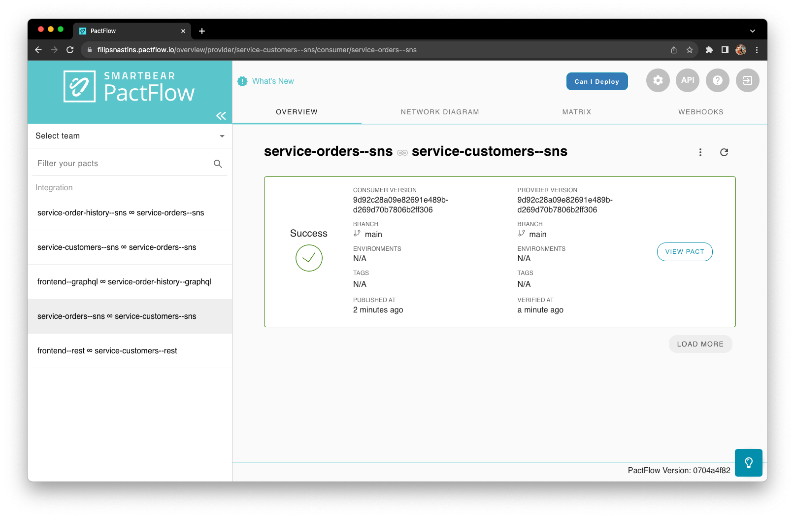
_PactFlow - contracts are verified_

## Running Pact in a Deployment Pipeline (CI/CD)

For a complete guide of integrating Pact into your CI/CI workflow, take a look at
[Pact documentation - CI/CD setup guide](https://docs.pact.io/pact_nirvana).

The Pact guide covers more than just configuring Pact in the CI/CD pipeline,
but first getting the team aligned on the process of contract testing,
and getting started with the simplest and non-intrusive setup that will let
you evaluate if contract testing and Pact are a good fit for your project.

Since contract testing is a collaboration technique, it's important to get the team on board
first, before introducing mandatory blocking steps to the deployment pipeline.

> Contracts are not a replacement for good communication between or within teams.
> In fact, contracts require collaboration and communication.

A short summary of topics covered by the [Pact CI/CD setup guide](https://docs.pact.io/pact_nirvana):

1. Learn about Pact, talk, and get team alignment to try it out
2. Get a single test working manually.
3. Manually integrate with Pact Broker/PactFlow.
4. Integrate Pact Broker/PactFlow into the deployment pipeline.
5. Use [Can-I-Deploy](https://docs.pact.io/pact_broker/can_i_deploy)
   to verify if the version of your application you're about to deploy
   is compatible with other applications that are already deployed in that environment
   (not covered in this example project).
6. Record deployments and releases to the Pact Broker/PactFlow
   (not covered in this example project).

### Setting up the Deployment Pipeline for the Example Application

From [github.com/pactflow/example-provider](https://github.com/pactflow/example-provider):

> **When using Pact in a CI/CD pipeline, there are two reasons for a Pact verification task to take place:**
>
> - When the Consumer changes - to see if the Provider is compatible with the new expectations
> - When the Provider changes - to make sure it does not break any existing Consumer expectations

**The important part is to establish quick feedback loops for the changes in the contract:**

- Trigger the Provider Contract tests in the Provider CI/CD pipeline when a new Consumer contract version is published.
- Get notified that changes in your Consumer contract are incompatible with the existing Provider contract,
  i.e. the Provider contract tests failed in the Provider CI/CD pipeline.
- Before deploying a new version of the Consumer, verify that it's compatible with the currently deployed
  version of the Provider. Using [Can-I-Deploy](https://docs.pact.io/pact_broker/can_i_deploy) is one way of doing it.

The example application uses GitHub Actions for running the deployment pipeline.
Implemented workflow examples with PactFlow and GitHub Actions are in [.github/workflows/](.github/workflows/).
There're two deployment pipeline workflows:

- [build.yml](.github/workflows/build.yml) - a regular deployment pipeline workflow that runs on every commit.
  It builds and tests the application, including running Pact contract tests.
- [pact-verify-provider-contract.yml](.github/workflows/pact-verify-provider-contract.yml) - a workflow
  that's triggered by a webhook from Pact Broker/PactFlow when a new Consumer contract version is published.
  The workflow runs the Provider contract tests against the new Consumer contract version and publishes
  the verification results back to the Pact Broker/PactFlow.

The examples in this project don't go the full way of setting up the deployment pipeline
using [Can-I-Deploy](https://docs.pact.io/pact_broker/can_i_deploy) and recording deployments and releases.
The concrete implementation will differ depending on the existing CI/CD setup and adopted ways of working.

For more examples, see:

- <https://github.com/pactflow/example-consumer>
- <https://github.com/pactflow/example-provider>

#### When the Consumer Changes

- On a new Consumer contract version - verify it against the Provider
  ([.github/workflows/pact-verify-provider-contract.yml](.github/workflows/pact-verify-provider-contract.yml)).


- On a new Consumer contract version - verification against the Provider failed.
  ([.github/workflows/pact-verify-provider-contract.yml](.github/workflows/pact-verify-provider-contract.yml)).

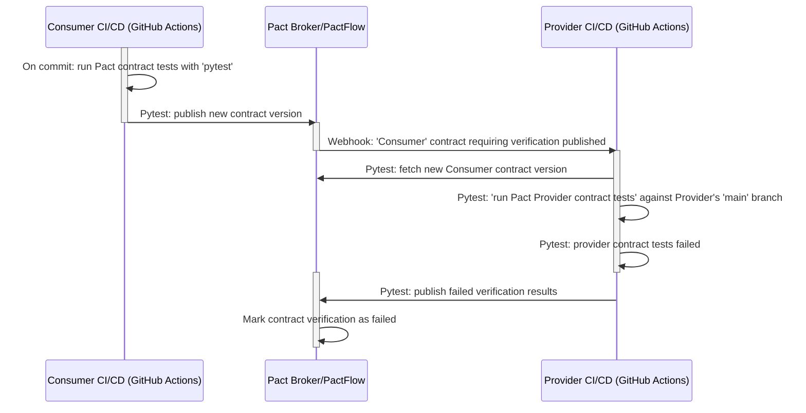

- On a commit in Consumer repository, but Consumer contract hasn't changed -
  automatically mark it as verified in Pact Broker/PactFlow without running the Provider contract tests.

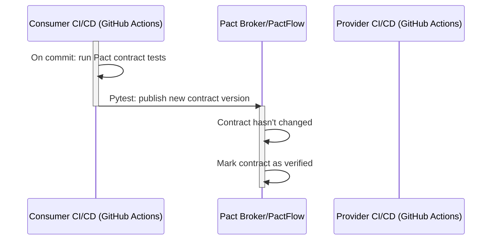

#### When the Provider Changes

- On a new commit in Provider repository - verify Provider contract against Consumer contracts from Pact Broker/PactFlow
  ([.github/workflows/build.yml](.github/workflows/build.yml)).

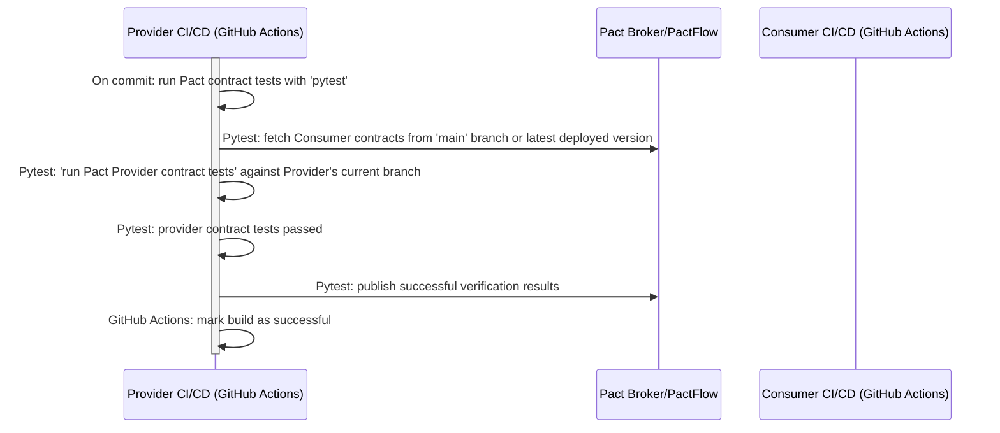

- On a new commit in the Provider repository - Provider contract verification failed
  ([.github/workflows/build.yml](.github/workflows/build.yml)).


### Configuring Pact Broker/PactFlow with Terraform

Setting up Pacticipants and their webhook configurations in Pact Broker/PactFlow manually
is tedious and error-prone, especially when you're growing the number of services and teams.

You can use [Pact Broker Terraform Provider](https://docs.pact.io/pact_broker/terraform_provider)
to automate the configuration of Pact Broker/PactFlow.

The example project uses Terraform for automating the configuration of PactFlow:

- Creation of user accounts and teams.
- Creation of Pacticipants.
- Configuration of Webhooks.

See [terraform-pactflow/](terraform-pactflow/) directory for the example Terraform configuration.

## Testing Breaking Changes in Contracts with Pact

In this section we'll test that Pact detects breaking changes in both the Consumer and Producer contracts,
and observe how PactFlow displays the results.
See [Run Pact Contract Tests with PactFlow.io](#run-pact-contract-tests-with-pactflowio) section for getting
started with PactFlow.

### Contract Testing Protobufs and Similar Structured Data Serialization Formats

The example application uses [Protobuf](https://protobuf.dev/) for serializing structured data
in the asynchronous messaging between services over AWS SNS SQS.

Protobuf (Protocol Buffers) is a language-neutral, platform-neutral extensible mechanisms for serializing structured data.
Protobuf is schema-driven and has built-in versioning or backwards/forwards compatibility.
With Protobuf, Consumers and Producers can work with different versions of the schema at the same time,
and they will continue to work as long as the changes are backwards/forwards compatible.

> That is an extremely valuable feature when you’re dealing with a big production system,
> because it allows you to update different components of the system independently,
> at different times, without worrying about compatibility.
> — _<https://pactflow.io/blog/the-case-for-contract-testing-protobufs-grpc-avro/>_

Protobuf is a schema-driven format, and having a defined schema if very important when working with
big production systems. However, just adhering to the schema is not enough to ensure compatibility between
the Consumer and Provider. Therefore, it's important to distinguish `schema` from the `contract semantics`.

The Protobuf definition schema is a syntactic construct which doesn't enforce any semantic meaning
to the data. The contract semantics is the meaning of the data. contract testing allows us to verify
that a Consumer is not only able to parse the data with a schema, but also _understand_ the meaning of the data.

For Protobuf schema management it's worth mentioning [buf.build](https://buf.build/docs).
buf.build is a Protobuf schema management tool that helps you define, lint, and generate
code for your Protobuf schema. One of it's advantages is a schema breaking change detection tool,
that will help you catch syntactic breaking changes.
For detecting semantic breaking changes, you would still need to use contract testing.

Read more about the case case for contract testing Protobufs and similar
interface definition languages (IDL) in the Pact blog:

- <https://pactflow.io/blog/the-case-for-contract-testing-protobufs-grpc-avro>
- <https://pactflow.io/blog/contract-testing-for-grpc-and-protobufs/>

For more benefits of contract testing beyond catching breaking changes (both syntactic and semantic),
see [Contract Testing Beyond Catching Breaking Changes](#contract-testing-beyond-catching-breaking-changes) section.

Pact supports testing Protobuf contracts with a Protobuf plugin.
At the time of writing, Pact Plugin for Protobuf was not available in the Python Pact library,
so the example project converts Protobuf messages to JSON and tests them as JSON contracts.
See more [Pact Protobuf testing examples](https://docs.pact.io/implementation_guides/pact_plugins/examples/protobuf)
in the Pact documentation.

### Breaking Consumer Contract

Testing of the Consumer contract changes happen in the Provider repository,
because it's the Provider that should pull the new contract version and run the contract tests against it.
The testing is integrated with the Pact Broker/Pact Flow, that triggers `contract requiring verification published`
webhook to the CI/CD server (e.g. GitHub Actions) to run the tests in the Provider repository.

Taking `service-customers--sns` as an example consumer. We'll change the expectation about
the `order_total.units` format. Currently it expects a `string` value, but we'll change it to `integer`.

- In the [test_sns_consumer_contract\_\_orders.py](tests/customers/test_sns_consumer_contract__orders.py),
  change `order_total.units` from `string` to `integer`. Protobuf will still serialize the value as a `string`,
  but the contract will expect an `integer`, which will cause the contract test to fail.

```diff
--- a/tests/customers/test_sns_consumer_contract__orders.py
+++ b/tests/customers/test_sns_consumer_contract__orders.py
@@ -70,7 +70,7 @@ async def test_consume_order_created_event(
         "order_id": Term(Format.Regexes.uuid.value, "cc935616-e439-45a9-89ed-c6ef32bbc59e"),
         "order_total": Like(
             {
-                "units": "100",
+                "units": 100,
                 "nanos": 990000000,
             }
```

- Commit the changes under a new branch, e.g. `test/break-consumer-contract`.
  This will trigger the deployment pipeline and the new contract version will be published to PactFlow.

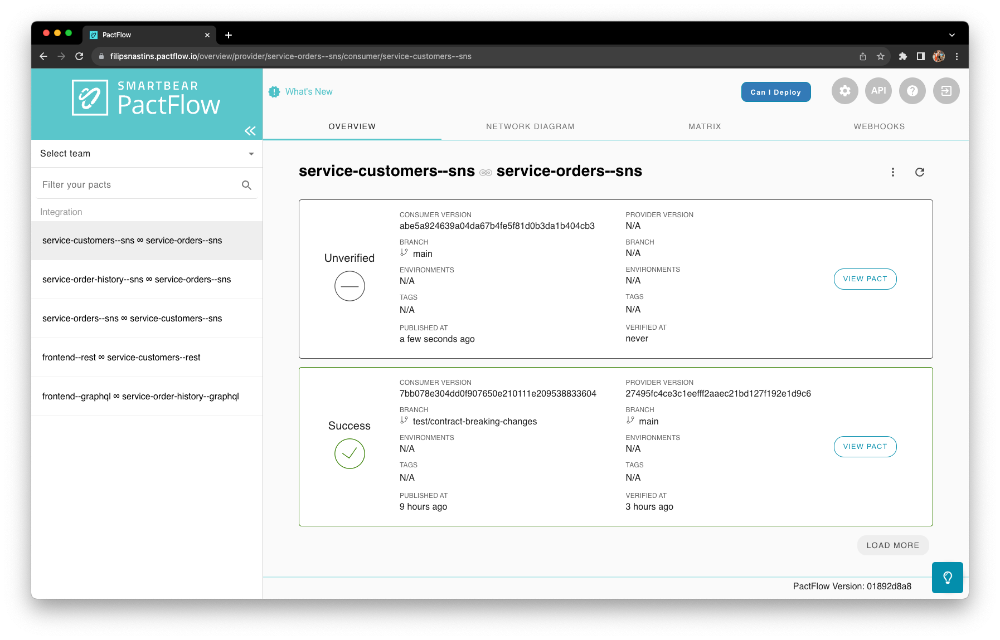
_PactFlow - contract is in Unverified state_

If the PactFlow is configured to work in a CI/CD pipeline as per the example in
[Running Pact in a Deployment Pipeline (CI/CD)](#running-pact-in-a-deployment-pipeline-cicd) section,
the new Consumer contract version will trigger `contract requiring verification published` event in PactFlow.
The PactFlow event will send a webhook to GitHub, which will trigger the
[pact-verify-provider-contract.yml](.github/workflows/pact-verify-provider-contract.yml) GitHub Actions workflow.

The workflow will run the Provider contract tests against the new Consumer contract version and publish the verification results.
This process should happen automatically, and the `service-customers--sns` Consumer team shortly will be notified
that their changes are incompatible with the existing `service-orders--sns` Provider contract.

- The [workflow in the Provider repository](https://github.com/filipsnastins/consumer-driven-contract-testing-with-pact-python/actions/runs/6868498483/job/18679182936)
  will fail with the following error:

```diff
Failures:

  1) Verifying a pact between service-customers--sns and service-orders--sns Given New order is created OrderCreated event has matching content
     Failure/Error: expect(actual_contents).to match_term expected_contents, diff_options, example

       Actual:
        {
          "event_id": "fddf40ed-9c73-418b-9e12-bbf3ecc59f67",
          "correlation_id": "58b587a2-860c-4c4a-a9af-70457ffae596",
          "order_id": "c7a3ced2-163c-44a7-8996-7604ed0194ad",
          "customer_id": "1e5df855-a757-4aa5-a55f-2ddf6930b250",
          "order_total": { "units": "123", "nanos": 990000000 },
          "created_at": "2023-11-14T19:25:21.425832+00:00"
        }

Diff
--------------------------------------
Key: - is expected
    + is actual
Matching keys and values are not shown

{
  "order_total": {
-    "units": Integer
+    "units": String
  }
}

Description of differences
--------------------------------------
* Expected an Integer (like 100) but got a String ("123") at $.order_total.unit
```

This should spark a conversation between the teams (or colleagues on the same team if their own the Provider service)
about the changes in the contract and the best way to proceed with the changes.

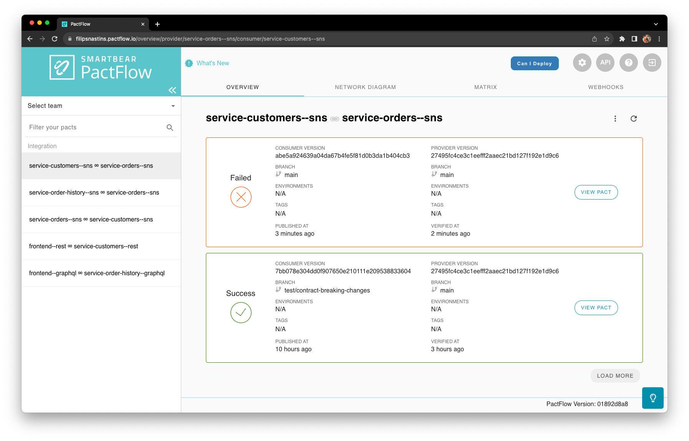
_PactFlow - contract is in the Failed state_

- To fix the contract, change `order_total.units` back to `string`, commit and push the changes to GitHub.
  This time, the `contract requiring verification published` event won't be triggered,
  because the Consumer contract returned to its previous state and has been already verified,
  so triggering the Provider contract verification is not necessary.

### Breaking Provider Contract

Unlike testing breaking changes from the Consumer side, the Provider contract side happens exclusively inside the
Provider repository. It's because the Provider tests will fetch the latest contract version from Pact Broker/PactFlow,
and it doesn't have to trigger the deployment pipeline in the Consumer repository.
This way, the Provider development team gets very quick feedback from their tests - by running the tests locally or
in their own deployment pipeline.

- Taking the `service-customers--sns` as an example provider, go to [events.py](src/customers/events.py)
  and break the contract by setting the field `name` to an empty string.
  Since the Consumer `server-order-history--sns` depends on the `name` field, the contract will be broken.

```diff
--- a/src/customers/events.py
+++ b/src/customers/events.py
@@ -31,7 +31,7 @@ class CustomerCreatedEvent:
             event_id=str(self.event_id),
             correlation_id=str(self.correlation_id),
             customer_id=str(self.customer_id),
-            name=self.name,
+            name="",
             created_at=self.created_at.isoformat(),
         )
```

- Run the Provider contract tests locally with `pytest -m "provider and customers__sns"` command and observe the failure.
  The Provider team got the immediate feedback that their changes are incompatible with the existing Consumer contract.

```diff
Failures:

  1) Verifying a pact between service-order-history--sns and service-customers--sns Given New customer is created CustomerCreated event has matching content
     Failure/Error: expect(actual_contents).to match_term expected_contents, diff_options, example

       Actual:
        {
          "event_id": "1e5df855-a757-4aa5-a55f-2ddf6930b250",
          "correlation_id": "293178a5-4838-4e6a-8d63-18062093027e",
          "customer_id": "1e5df855-a757-4aa5-a55f-2ddf6930b250",
          "created_at": "2023-11-15T12:49:25.208438+00:00"
        }

Diff
--------------------------------------
Key: - is expected
    + is actual
Matching keys and values are not shown

{
-  "name": String
}

Description of differences
--------------------------------------
* Could not find key "name" (keys present are: event_id, correlation_id, customer_id, created_at) at $
```

## Best Practices for Writing Consumer Contract Tests with Pact

Based on "Best practices for writing consumer tests" by Beth Skurrie - <https://www.youtube.com/watch?v=oPuHb9Rl8Zo>.
Watch the full video!

- The key is knowing what _not_ to test.
- Keep the scope of contract tests limited.
  Ideally, test only the components of your application that interact with a Provider in isolation.
  Since the Contract Tests are not a replacement for functional tests, you don't need to test
  the whole application end-to-end. Read more at ["Testing scope"](https://docs.pact.io/getting_started/testing-scope).
- Don't use Pact for the functional testing of Consumers or Providers.
- Don't use Pact for testing business logic or UI.
- Don't write too restrictive Pact matchers. Make your response expectations as loose as possible.
- Try to use BDD style notation to describe the business actions, rather than describing
  HTTP or messaging mechanisms. The contract tests should read like a proper, coherent sentance.
  - Use Pact's `given`, `upon_receiving`, `with_request` and `will_respond_with`
    constructs to describe a business action.
- Use deterministic data. Avoid random data in your Pacts because it will mark a contract as changed,
  when in fact it hasn't.
- Don't be afraid of duplication between functional and contract tests.
  - You can use fakes and mocks in contract tests to simplify and limit their scope.
  - Functional tests that use real components will catch all functional bugs.
    It's not in scope of contract tests.
- It's not the job of the Consumer to be a test harness for the Provider.
- Responses can have extra keys without failing the verification, but requests cannot - Postel's law.
- Contract tests aren't designed to operate alone.
  Contract tests _supplement_ unit, functional and all other types of tests.
- Contract tests focus only on the messages (requests and responses).
  Functional tests also check for side effects.
- Don't check for side effects in contract tests, e.g. if an object is stored in a database.
  It's the responsibility of the functional tests.

## Contract Testing Beyond Catching Breaking Changes

The benefits of contract testing go beyond catching breaking changes in the contract,
both syntactic and semantic, before release to production.

- Consumer-Driven contract testing is more than a testing approach.
  Used a collaboration technique, it helps to establish clear lines of communication and collaboration
  between microservices and teams that consume them.

- Ensures that compatible versions of the Consumer and Provider are deployed to production,
  e.g. by using Pact's [Can-I-Deploy](https://docs.pact.io/pact_broker/can_i_deploy) tool.

- Provides full visibility into a Provider usage - Consumer-Driven contract testing gives the Provider team
  visibility into how their service is being used by Consumers.
  All the contracts are stored in a centralized place like Pact Broker/PactFlow,
  and the Provider team can see all the Consumers that depend on their service.
  It helps discovering unused fields and messages that are not used by any Consumers,
  and misunderstandings about the Provider usage.

- [Specification by example](https://gojko.net/books/specification-by-example/) -
  Consumer-Driven contract testing facilitates the collaboration
  between the Consumer and Provider teams of defining the contract, driven by real-world
  examples of how the Consumer uses the Provider, rather than using abstract requirements.
  As a result, the Consumer and Provider teams will have a better shared understanding
  of the contract and the business domain.

- Living documentation - since Consumer-Driven contracts were defined by real-world examples,
  they can be used as a living documentation of how the Consumer uses the Provider.
  The contracts are always up to date and reflect the current state of Consumer/Provider relationships.
  The contract examples can be used as a reference when onboarding new team members,
  as a base for discussing new feature implementations, and in many other useful ways.

- Consumer/Provider network map - the contracts stored in Pact Broker/PactFlow can be used
  to generate a network map of the Consumer/Provider relationships.
  It's a useful tool for visualizing the dependencies between services and teams.
  See [example Application's Pact Network Diagram](#example-applications-pact-network-diagram) section.

- Transport concerns like HTTP verbs, paths, headers and messaging topic names
  may be encapsulated in a contract.

## Limitations and Corner Cases

- At the time of writing, Pact Python doesn't support Pact Plugins.

- Pact Pacticipant name must include a communication protocol, .e.g `--rest` or `--sns`.
  Due to Pact handling synchronous HTTP and asynchronous messaging contract tests differently,
  they can't be mixed in the same Pacticipant.

- Due to the above, a single service can have multiple Pacticipants, one for each communication protocol
  the service supports. To run tests against the specific protocol, e.g. in the case
  when a Consumer contract has changed and you need to verify it against the specific Provider's protocol,
  you would need to use `pytest` markers and test selectors (`pytest -m "orders__sns"`).
  This is implemented in this example project.

- GraphQL contract testing with python-pact - queries and mutations must be formatted in the same way as in the contract,
  including spaces and new lines, otherwise Pact Mock Server would not be able to match the request body
  (when the request is not JSON, Pact Mock Server does the full string match; GraphQL request is a string).
  One way out would be to always "minify" (remove all whitespace and newlines) the GraphQL queries and mutations
  before sending the requests. At the time of writing, GraphQL plugin is not available in the Python Pact library,
  but is implemented for other languages, e.g. [Pact JS](https://docs.pact.io/implementation_guides/javascript/docs/graphql).

## References

- Consumer-Driven Contracts: A Service Evolution Pattern -
  <https://martinfowler.com/articles/consumerDrivenContracts.html>

- ContractTest - <https://martinfowler.com/bliki/ContractTest.html>

- Pact documentation - <https://docs.pact.io>

- How Pact works - <https://pactflow.io/how-pact-works>

- [Building Microservices, 2nd Edition](https://samnewman.io/books/building_microservices_2nd_edition/) - book by Sam Newman.
  Chapter 9 - Testing.

- Nubank: Why We Killed Our End-to-End Test Suite -
  <https://building.nubank.com.br/why-we-killed-our-end-to-end-test-suite/>

- Beyond REST - contract testing in the Age of gRPC, Kafka & GraphQL • Matt Fellows • YOW! 2022 - <https://www.youtube.com/watch?v=ESM84C7QKl8>.

- Best practices for writing consumer tests by Beth Skurrie - <https://www.youtube.com/watch?v=oPuHb9Rl8Zo>.

- Testing the boundaries by Sam Newman - <https://pact.io/pactober/2023/sam-newman>.

- Contract testing For Microservices IS A MUST by Dave Farley - <https://www.youtube.com/watch?v=Fh8CqZtghQw>.

- The case for contract testing Protobufs, gRPC and Avro:

  - <https://pactflow.io/blog/the-case-for-contract-testing-protobufs-grpc-avro>
  - <https://pactflow.io/blog/contract-testing-for-grpc-and-protobufs/>

- Pact CI/CD configuration examples:

  - <https://docs.pact.io/pact_nirvana>
  - <https://github.com/pactflow/example-consumer>
  - <https://github.com/pactflow/example-provider>

- Contract testing tools:

  - <https://pact.io>
  - <https://spring.io/projects/spring-cloud-contract>
  - <https://specmatic.in>

## Development

### Example Application's Sample Requests

- Create customer.

```bash
curl -X POST --header "Content-Type: application/json" -d '{
  "name": "John Doe"
}' http://localhost:9701/customer
```

- Get customer.

```bash
curl http://localhost:9701/customer/d5c6999b-9ee3-4ba1-aec0-6fbe8d9d8636
```

- Create order.

```bash
curl -X POST --header "Content-Type: application/json" -d '{
  "customer_id": "d5c6999b-9ee3-4ba1-aec0-6fbe8d9d8636",
  "order_total": 12399
}' http://localhost:9702/order
```

- Get order.

```bash
curl http://localhost:9702/order/8fccc85c-bbdd-47fb-b6c9-c5ed9a8d88df
```

- Get order history for all customers (GraphQL query).

```bash
curl -X POST -H "Content-Type: application/json" -d '{"query": "{getAllCustomers {id name orders {id orderTotal state}}}"}' http://localhost:9703/graphql
```

### Links

- Pact Broker: <http://localhost:9292>

- DynamoDB Admin: <http://localhost:8001>

- Order history GraphiQL IDE: <http://localhost:9703/graphql>

### Commands

- Format and lint code.

```bash
poetry run format
poetry run lint
```

- Run tests. Test execution order is configured with `pytest-order` to run `consumer` tests first, then `provider` tests.

```bash
poetry run test
poetry run test-ci  # With test coverage
```

- Generate Protobuf code with [buf](https://buf.build).

```bash
brew install bufbuild/buf/buf

cd src/adapters/proto
buf generate .
```

- Generate C4 diagrams with PlantUML from [docs/architecture/c4](docs/architecture/c4)
  (get plantuml.jar at <https://plantuml.com/starting>).

```bash
java -jar plantuml.jar -DRELATIVE_INCLUDE="." docs/architecture/c4/**/*.puml
```
