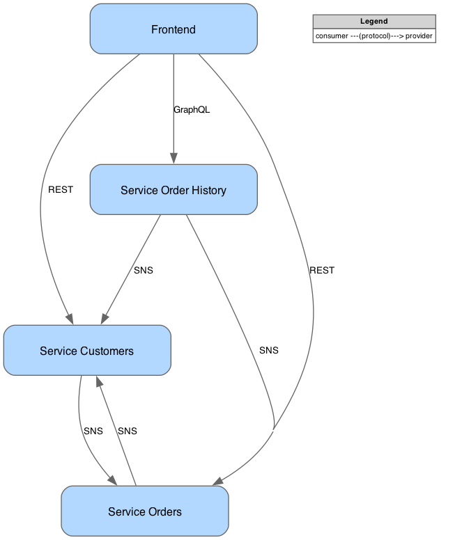

# Consumer-Driven Contract Testing (CDC) with Pact

An example of applying Consumer-Driven Contract Testing (CDC) for testing microservice compatibility in isolation.

- [Consumer-Driven Contract Testing (CDC) with Pact](#consumer-driven-contract-testing-cdc-with-pact)
  - [About Contract Testing](#about-contract-testing)
  - [Using Pact as a Contract Testing Tool](#using-pact-as-a-contract-testing-tool)
  - [Pact Network Diagram](#pact-network-diagram)
  - [Sample Application Architecture](#sample-application-architecture)
    - [System Context Diagram](#system-context-diagram)
    - [Container Diagram](#container-diagram)
  - [Development and Testing](#development-and-testing)
    - [URLs](#urls)
    - [Sample Requests](#sample-requests)
    - [Format, Lint, Test](#format-lint-test)
  - [TODO References](#todo-references)

## About Contract Testing

TODO ...

## Using Pact as a Contract Testing Tool

## Pact Network Diagram

Generated from Pact Broker's <http://localhost:9292/integrations>
with [src/diagram/generate_pact_network_diagram.py](src/diagram/generate_pact_network_diagram.py) script.



## Sample Application Architecture

### System Context Diagram


### Container Diagram


## Development and Testing

- Generate Protobuf with [buf](https://buf.build)

TODO this will fail, need to manually append path

```bash
brew install bufbuild/buf/buf

cd src/adapters/proto
buf generate .
```

- Run applications and Pact Broker locally with Docker Compose

```bash
docker compose up
```

- Run tests

```bash
pytest
```

### URLs

- Pact Broker URL: <http://localhost:9292>

  - Export service network graph at: <http://localhost:9292/integrations>

- DynamoDB Admin: <http://localhost:8001>

- Order history GraphiQL IDE: <http://localhost:9703/graphql>

### Sample Requests

- Create customer

```bash
curl -X POST --header "Content-Type: application/json" -d '{
  "name": "John Doe"
}' http://localhost:9701/customer
```

- Get customer

```bash
curl http://localhost:9701/customer/d5c6999b-9ee3-4ba1-aec0-6fbe8d9d8636
```

- Create order

```bash
curl -X POST --header "Content-Type: application/json" -d '{
  "customer_id": "d5c6999b-9ee3-4ba1-aec0-6fbe8d9d8636",
  "order_total": 12399
}' http://localhost:9702/order
```

- Get order

```bash
curl http://localhost:9702/order/8fccc85c-bbdd-47fb-b6c9-c5ed9a8d88df
```

- Get order history for all customers

```bash
curl -X POST -H "Content-Type: application/json" -d '{"query": "{getAllCustomers {id name orders {id orderTotal state}}}"}' http://localhost:9703/graphql
```

### Format, Lint, Test

- Format and lint code

```bash
poetry run format
poetry run lint
```

- Run tests.
  Test execution is ordered with `pytest-order` to run Consumer tests first, then Provider tests,
  because Provider tests depend on the existence of the Consumer pact

```bash
poetry run test
poetry run test-ci  # with test coverage
```

## TODO References

- <https://docs.pact.io/>
- <https://pactflow.io/blog/the-case-for-contract-testing-protobufs-grpc-avro/> - the need for contract testing
  even when using Protobuf
