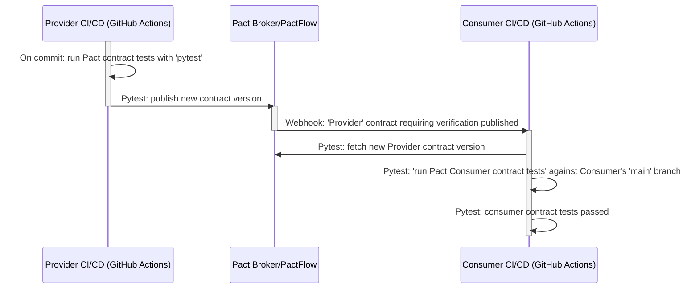

# Consumer-Driven Contract Testing with Pact

**Work-in-progress.**


An example of applying Consumer-Driven Contract Testing (CDC) for testing microservice compatibility in isolation.

- [Consumer-Driven Contract Testing with Pact](#consumer-driven-contract-testing-with-pact)
  - [What is Contract Testing](#what-is-contract-testing)
  - [Consumer-Driven Contract Testing](#consumer-driven-contract-testing)
  - [Pact as a Consumer-Driven Contract Testing Tool](#pact-as-a-consumer-driven-contract-testing-tool)
  - [Example Application Architecture (C4)](#example-application-architecture-c4)
    - [System Context Diagram](#system-context-diagram)
    - [Container Diagram](#container-diagram)
  - [Using Pact for Testing the Example Application](#using-pact-for-testing-the-example-application)
    - [Example Application's Pact Network Diagram](#example-applications-pact-network-diagram)
    - [Run Pact Contract Tests locally with self-hosted Pact Broker](#run-pact-contract-tests-locally-with-self-hosted-pact-broker)
    - [Run Pact Contract Tests with PactFlow.io](#run-pact-contract-tests-with-pactflowio)
  - [Running Pact in a Deployment Pipeline (CI/CD)](#running-pact-in-a-deployment-pipeline-cicd)
    - [Setting up the Deployment Pipeline for the Example Application](#setting-up-the-deployment-pipeline-for-the-example-application)
      - [Workflow - Consumer Contract Changed](#workflow---consumer-contract-changed)
      - [Workflow - Provider Contract Changed](#workflow---provider-contract-changed)
    - [Configuring Pact Broker/PactFlow with Terraform](#configuring-pact-brokerpactflow-with-terraform)
  - [References](#references)
  - [Development](#development)
    - [Example Application's Sample Requests](#example-applications-sample-requests)
    - [Links](#links)
    - [Development Commands](#development-commands)

## What is Contract Testing

- [ ] Contract testing vs integrated end-to-end testing
- [ ] Contract testing vs functional testing

## Consumer-Driven Contract Testing

- [ ] Consumer-driven contract testing as a collaboration technique
  - Fostering clear lines of communication and collaboration, between microservices and teams that consume them
  - Consumer-driven contract tests make communication between the teams explicit.
  - The explicit reminder of [Conway’s Law](https://martinfowler.com/bliki/ConwaysLaw.html).
  - Agile stories are often referred to as a placeholder for a conversation. CDCs are just like that

## Pact as a Consumer-Driven Contract Testing Tool

- [ ] When to not use Pact
- [ ] Best practices when writing contracts
- [ ] Testing syntax vs semantics

## Example Application Architecture (C4)

The example application is a made-up e-commerce system built as microservices.

### System Context Diagram


### Container Diagram


## Using Pact for Testing the Example Application

In this example application, the [Pacticipant](https://docs.pact.io/pact_broker/advanced_topics/pacticipant)
names follow the convention `<application-name>--<communication-protocol>`.
For example, `service-customers--rest` is a `service-customers` application communicating over REST (synchronous HTTP),
and `service-customers--sns` is a `service-customers` application communicating over SNS (asynchronous messaging).

The need to name Pacticipants depending on the communication protocol is because Pact uses
different mechanisms for verifying contracts depending wether it's a synchronous HTTP-based protocol or asynchronous messaging.
Pact `HTTP` contract tests use `pact.Verifier`, and Pact `Messaging` contract tests use `pact.MessageProvider`,
and they can't be mixed.

- List of the example application's Pacticipants:
  - `frontend--graphql`
  - `frontend--rest`
  - `service-customers--rest`
  - `service-customers--sns`
  - `service-order-history--graphql`
  - `service-order-history--sns`
  - `service-orders--rest`
  - `service-orders--sns`

### Example Application's Pact Network Diagram

Generated from Pact Broker's <http://localhost:9292/integrations> with
[generate_pact_network_diagram.py](src/diagram/generate_pact_network_diagram.py) script.


### Run Pact Contract Tests locally with self-hosted Pact Broker

...

- Install Pact CLI - [complete installation instruction on GitHub Releases page](https://github.com/pact-foundation/pact-ruby-standalone/releases).

```bash
curl -fsSL https://raw.githubusercontent.com/pact-foundation/pact-ruby-standalone/master/install.sh | PACT_CLI_VERSION=v2.0.10 bash
```

- Install Python dependencies with [Poetry](https://python-poetry.org/).

```bash
poetry install --with dev
poetry shell
```

- Set PYTHONPATH to include `src` directory.

```bash
export PYTHONPATH=src:$PYTHONPATH
```

- Run example application and Pact Broker locally with Docker Compose.

```bash
docker compose up
```

- Open local Pact Broker UI - <http://localhost:9292>.
  Login with `pactbroker`/`pactbroker` credentials.
  The list of contracts should be empty because we haven't run any tests yet.

- Run `consumer` tests first (remember about consumer-driven).
  Pact will generate contract files and save them in the `pacts` directory.

```bash
poetry run pytest -m "consumer"
```

- Pact Broker UI (<http://localhost:9292>) should still be empty because
  we haven't published contracts from `pacts` directory to the Pact Broker yet.

- Publish contracts from the `pacts` directory to the local Pact Broker.
  **Note: don't store your Pact Broker credentials in plain text;** this project is just an example.

```bash
pact-broker publish --auto-detect-version-properties \
    --broker-base-url http://localhost:9292 \
    --broker-username pactbroker \
    --broker-password pactbroker \
    pacts
```

- Refresh Pact Broker UI (<http://localhost:9292>) and you should see the list of contracts.
  Notice that `Last Verified` column is empty because the contracts haven't been verified
  against the `providers` yet.


- Verify `provider` contracts from the local Pact Broker.
  The Pact `provider` tests will fetch latest contracts from the Pact Broker and run the tests against them.
  Verification results will be published back to the Pact Broker
  because `PACT_PUBLISH_VERIFICATION_RESULTS` environment variable is set to `true`.
  Usually, you would publish test results to the Pact Broker only in CI/CD pipeline,
  so when working on a production project, omit the environment variable when running tests locally.

```bash
PACT_PUBLISH_VERIFICATION_RESULTS=true poetry run pytest -m "provider"
```

- Refresh Pact Broker UI (<http://localhost:9292>) and you should that all contracts have been verified.


### Run Pact Contract Tests with PactFlow.io

PactFlow.io is a SaaS version of Pact Broker. It has a free tier for up to 5 integrations,
which is suitable for a proof-of-concept.

- Create a free account on <https://pactflow.io>

- Generate [read/write API token](https://docs.pactflow.io/docs/user-interface/settings/api-tokens/) for your PactFlow account
  and set environment variables:

```bash
export PACT_BROKER_BASE_URL=https://<your-account-name>.pactflow.io
 export PACT_BROKER_TOKEN=<your-read-write-api-token>
```

- Remove previously generated contracts from the `pacts` directory.

```bash
rm -r pacts/*.json
```

- Run `consumer` tests. This time include `pactflow` marker to run only a subset of tests,
  since PactFlow free tier has a limit of 5 integrations.

```bash
poetry run pytest -m "consumer and pactflow"
```

- Publish contracts from the `pacts` directory to the PactFlow. Notice that we don't need to specify
  Pact Broker URL and credentials because they are already set in the environment variables.

```bash
pact-broker publish --auto-detect-version-properties pacts
```


- Verify Pacts and publish verification results.
  Usually, you would publish test results to the Pact Broker only in CI/CD pipeline,
  so when working on a production project, omit the environment variable when running tests locally.

```bash
PACT_PUBLISH_VERIFICATION_RESULTS=true pytest -m "provider and pactflow"
```


## Running Pact in a Deployment Pipeline (CI/CD)

For a complete guide of integrating Pact into your CI/CI workflow, take a look at
[Pact documentation - CI/CD setup guide](https://docs.pact.io/pact_nirvana).

The guide covers more than just configuring Pact in the CI/CD pipeline,
but first getting the team aligned on the process of contract testing,
and getting started with the simplest and non-intrusive setup that will let
you evaluate if Contract Testing and Pact are a good fit for your project.

Since contract testing is a collaboration technique, it's important to get the team on board
first, before introducing mandatory blocking steps to the deployment pipeline.

> Contracts are not a replacement for good communication between or within teams.
> In fact, contracts require collaboration and communication.

A short summary of topics covered by the [Pact CI/CD setup guide](https://docs.pact.io/pact_nirvana):

1. Lean about Pact, talk and get team alignment to try it out
2. Get a single test working manually.
3. Manually integrate with Pact Broker/PactFlow.
4. Integrate Pact Broker/PactFlow to deployment pipeline.
5. Use [Can-I-Deploy](https://docs.pact.io/pact_broker/can_i_deploy)
   to verify if the version of your application you're about to deploy
   is compatible with other application that are already deployed in that environment
   (not covered in this example project).
6. Record deployments and releases to the Pact Broker/PactFlow
   (not covered in this example project).

### Setting up the Deployment Pipeline for the Example Application

The example application uses GitHub Actions for running the deployment pipeline.
There're two deployment pipeline workflows:

- [build.yml](.github/workflows/build.yml) - a regular deployment pipeline workflow that runs on every commit.
  It build the application and runs all tests for the given application, including Pact contract tests.
- [pact-provider-contract-tests.yml](.github/workflows/pact-provider-contract-tests.yml) - a workflow
  that's triggered by a webhook from Pact Broker/PactFlow when a new `Consumer` contract version is published.
  The workflow runs the `Provider` contract tests against the new `Consumer` contract version, and publishes
  the verification results back to the Pact Broker/PactFlow.

The examples in this project don't go the full way of setting up the deployment pipeline
using [Can-I-Deploy](https://docs.pact.io/pact_broker/can_i_deploy) and recording deployments and releases.
The concrete implementation will differ depending on the existing CI/CD setup and adopted ways of working.

**The important part is to establish quick feedback loops for the changes in the contract:**

- Trigger the Provider Contract tests in the Provider CI/CD pipeline when a new Consumer contract version is published.
- Get notified that changes in your Consumer contract are incompatible with the existing Provider contract,
  i.e. the Provider contract tests failed in the Provider CI/CD pipeline.
- Before deploying a new version of the Consumer, verify that it's compatible with currently deployed
  version of the Provider. Using [Can-I-Deploy](https://docs.pact.io/pact_broker/can_i_deploy) is one way of doing it.

Implemented workflow examples with PactFlow and GitHub Actions (see [.github/workflows/](.github/workflows/)):

#### Workflow - Consumer Contract Changed

- New Consumer contract version is published - verify it against the Provider.


- Consumer contract hasn't changed - automatically mark it as verified
  without running the Provider contract tests.


- Consumer contract changed - verification against the Provider failed.


#### Workflow - Provider Contract Changed

- Provider contract changed - verify it against the Consumer.



- TODO Provider contract changed - verification against the Consumer failed.

### Configuring Pact Broker/PactFlow with Terraform

Setting up Pacticipants and their webhook configurations in Pact Broker/PactFlow manually
is tedious and error-prone, especially when you're growing the number of services and teams.

You can use [Pact Broker Terraform Provider](https://docs.pact.io/pact_broker/terraform_provider)
to automate the configuration of Pact Broker/PactFlow.

The example project uses Terraform for automating the configuration of PactFlow:

- Creation of user accounts and teams
- Creation of Pacticipants
- Configuration of Webhooks

See [terraform-pactflow/](terraform-pactflow/) directory for the example Terraform configuration.

## References

- <https://docs.pact.io>
- <https://pactflow.io/blog/the-case-for-contract-testing-protobufs-grpc-avro> - the need for contract testing
  even when using Protobuf.

## Development

### Example Application's Sample Requests

- Create customer.

```bash
curl -X POST --header "Content-Type: application/json" -d '{
  "name": "John Doe"
}' http://localhost:9701/customer
```

- Get customer.

```bash
curl http://localhost:9701/customer/d5c6999b-9ee3-4ba1-aec0-6fbe8d9d8636
```

- Create order.

```bash
curl -X POST --header "Content-Type: application/json" -d '{
  "customer_id": "d5c6999b-9ee3-4ba1-aec0-6fbe8d9d8636",
  "order_total": 12399
}' http://localhost:9702/order
```

- Get order.

```bash
curl http://localhost:9702/order/8fccc85c-bbdd-47fb-b6c9-c5ed9a8d88df
```

- Get order history for all customers (GraphQL query).

```bash
curl -X POST -H "Content-Type: application/json" -d '{"query": "{getAllCustomers {id name orders {id orderTotal state}}}"}' http://localhost:9703/graphql
```

### Links

- Pact Broker: <http://localhost:9292>

- DynamoDB Admin: <http://localhost:8001>

- Order history GraphiQL IDE: <http://localhost:9703/graphql>

### Development Commands

- Generate Protobuf code with [buf](https://buf.build).

```bash
brew install bufbuild/buf/buf

cd src/adapters/proto
buf generate .
```

- Format and lint code.

```bash
poetry run format
poetry run lint
```

- Run tests.
  Test execution order is configured with `pytest-order` to run `consumer` tests first, then `provider` tests.

```bash
poetry run test
poetry run test-ci  # With test coverage
```
