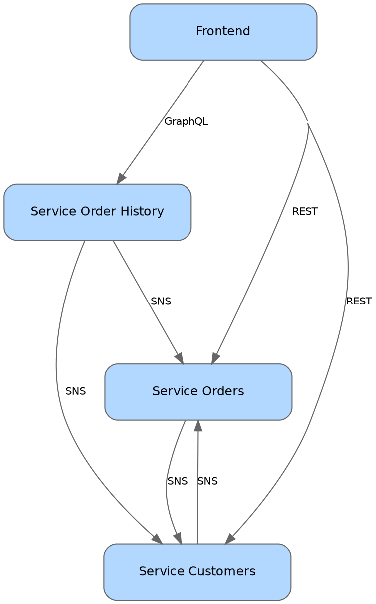

# consumer-driven-contract-testing-with-pact-python

**Work in progress**

An example of applying Consumer-Driven Contract Testing (CDC) for testing microservice compatibility in isolation.

## System diagram

Generated from Pact Broker network diagram (<http://localhost:9292/integrations>) and manually styled.



## Development

### Start local environment

- Generate Protobuf with [buf](https://buf.build)

```bash
brew install bufbuild/buf/buf

cd src/adapters/proto
buf generate .
```

- Run applications and Pact Broker locally with Docker Compose

```bash
docker compose up
```

### URLs

- Pact Broker URL: <http://localhost:9292>

  - Export service network graph at: <http://localhost:9292/integrations>

- DynamoDB Admin: <http://localhost:8001>

- Order history GraphiQL IDE: <http://localhost:9703/graphql>

### Sample requests

- Create customer

```bash
curl -X POST --header "Content-Type: application/json" -d '{
  "name": "John Doe"
}' http://localhost:9701/customer
```

- Get customer

```bash
curl http://localhost:9701/customer/d5c6999b-9ee3-4ba1-aec0-6fbe8d9d8636
```

- Create order

```bash
curl -X POST --header "Content-Type: application/json" -d '{
  "customer_id": "d5c6999b-9ee3-4ba1-aec0-6fbe8d9d8636",
  "order_total": 12399
}' http://localhost:9702/order
```

- Get order

```bash
curl http://localhost:9702/order/8fccc85c-bbdd-47fb-b6c9-c5ed9a8d88df
```

- Get order history for all customers

```bash
curl -X POST -H "Content-Type: application/json" -d '{"query": "{getAllCustomers {id name orders {id orderTotal state}}}"}' http://localhost:9703/graphql
```

### Format and lint code, and run tests

- Format and lint

```bash
poetry run format
poetry run lint
```

- Run tests.
  Test execution is ordered with `pytest-order` to run Consumer tests first, then Provider tests,
  because Provider tests depend on the existence of the Consumer pact.

```bash
poetry run test
poetry run test-ci  # with test coverage
```
